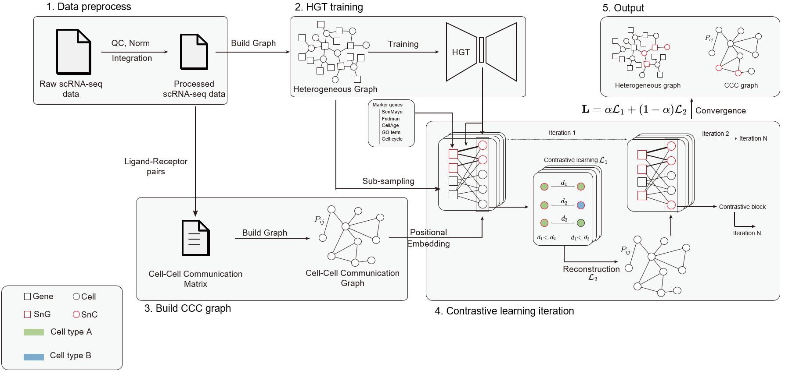

# Senescent Cell Analysis Framework

## Overview

This Python-based framework facilitates the advanced analysis of senescent cells using a variety of machine learning techniques, including graph neural networks and dimensionality reduction via autoencoders. Designed for scalability and robustness, the framework supports various datasets, integrates with modern machine learning tools like PyTorch and scanpy, and offers extensive capabilities for visualizing data.




## Key Features

- **Data Preprocessing**: Standardize and preprocess raw data for further analysis.
- **Dimensionality Reduction**: Use autoencoders to reduce data dimensions effectively, capturing essential features.
- **Graph Neural Networks**: Leverage Graph Attention Networks (GAT) to handle complex data structures typical in biological data.
- **Senescent Cell Identification**: Specialized models to detect and analyze senescent cells and their genetic markers.
- **Experiment Tracking**: Integration with Weights & Biases for real-time tracking of model performance and metrics.
- **Visualization**: Utilize seaborn and matplotlib for detailed visual representations of data insights.

## Getting Started

### Prerequisites

Ensure you have Python 3.8 or later installed. This project is developed and tested on Linux and macOS environments.

### Installation

1. **Clone the Repository**:
   ```bash
   git clone https://github.com/chthub/sencell.git
   cd sencell/
   ```

2. **Set Up a Virtual Environment** (recommended):
   ```bash
   conda create -n sencell_env python=3.8
   conda activate sencell_env
   ```

3. **Install Dependencies**:
   ```bash
   pip install -r requirements.txt
   ```

4. **Environment Variables**:
   Set necessary environment variables, if any (e.g., PYTHONHASHSEED for reproducibility).

### Usage

Run the main script using the following command with required flags:

```bash
python main3.py --output_dir ./outputs --exp_name "YourExperimentName" --device_index 0
```

#### Important Arguments

- `--output_dir`: Directory to store output files and results.
- `--exp_name`: Descriptive name for the experiment.
- `--device_index`: GPU device index if CUDA is available.

#### Example Command

To run the script for processing a specific dataset with GPU acceleration:

```bash
python main3.py --exp_name "Experiment_On_Disease" --output_dir ./outputs --device_index 0 --retrain
```

## Modules and Functions

- **utils.py**: Contains utility functions for data loading, preprocessing, and transformations.
- **plots.py**: Provides functions for plotting graphs, heatmaps, and other visualizations.
- **model_AE.py**, **model_GAT.py**, **model_Sencell.py**: Include model definitions and training procedures for autoencoders, Graph Attention Networks, and senescent cell identification models.
- **sampling.py**: Implements methods for sampling subgraphs and managing dataset variations.
- **main.py**: The main executable script orchestrating data loading, model training, and evaluation processes.


Run data2
``` bash
pdm run python main4.py --retrain --exp_name data2 --input_data_count /bmbl_data/huchen/deepSAS_data/deepSAS_data2.h5ad
```

**Cell Tables**
* Cell Table 1:
   * `cell_id`: numerical cell id.
   * `cell_name`: chracter cell id.
   * `ifSnCs`: Boolean indicating if the cell is predicted to be a SnC.
   * `SnC_scores`: Numeric value representing the SnC score, calculated from attention score, the same as main4.py.
* Cell Table 2:
   * `cell_type`: annoated cell types.
   * `number_of_cells`: total number of cells for each cell type.
   * `number_of_SnCs`: number of SnCs in each cell type.

**Gene Tables**
* Gene Table 1:
   * `rows`: name of genes.
   * `columns`: all the cell types.
   * `value`: SnG scores for each cell type, calcuated from attention score, modified from main4.py, but separate each cell type (not all SnCs).
* Gene Table 2:
   * gene_name: Name of the gene.
   * cell_type: all the cell types.
   * SnG_scores: SnG_scores for the gene in one cell type (from Gene Table 1).
   * p_val: p value from DEG table compared between SnC ands non-SnCs for each cell type.
   * logFC: log2FoldChange from DEG table compared between SnC ands non-SnCs for each cell type.
   * p_val_adj:p adjusted value from DEG table compared between SnC ands non-SnCs for each cell type.
* Gene Table 3 (cell type unique genes):
   * gene_name: name of genes.
   * cell_type: alll the cell types.
* DEG Table: DEG comparing SnCs and non-SnCs for each cell type, used for Gene Table 2 generation.

